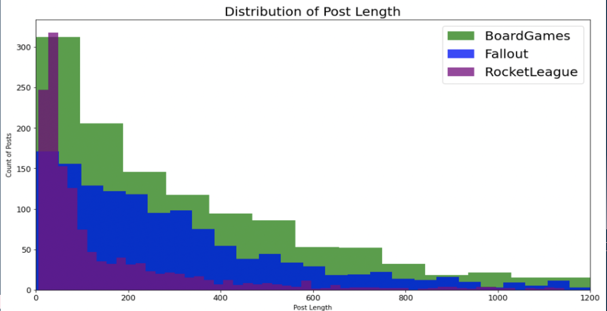
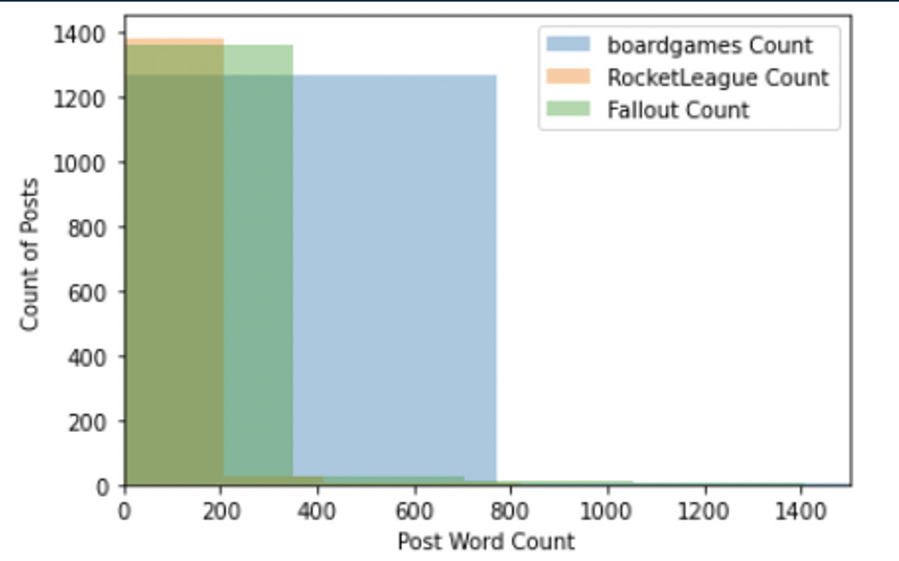

# Project 3: Executive Summary

As Reddit has 52m+ daily active users on communities, we will use posts history for 3 gaming categories how boardgames are used and understand human behavior. 
After performing NLP on our data gathered, few models have been created to check the accuracy scores and predictions. We have outlined precision scores and recall scores for each model and pick a model to predict. We can also evaluate from the model, most common words used in boardgames category to understand the postive or negative feedback. 

The data only includes post title and description for our modeling. 
- Baseline with data show:
**Fallout         0.355556**
**RocketLeague    0.333333**
**boardgames      0.311111**

** Distribution of post length for all 3 subreddits **
 
    
** Distribution of post word count for all 3 subreddits **
 

** Distribution of 25 top common words used for boardgames **
 
 
 Based on our evaluation, there has been postive relation with posts information to boardgames and there is potential  for new discovery of boardgames. 
 
 Our new predicted values with the MultinomialNB model which produced an accuracy of 80.64% are:
 
|---|precision|recall|f1-score|support|
|---|---|---|---|---|
|boardgames|0.902098|0.808777|0.852893|319.00000|
|RocketLeague|0.762836|0.881356|0.817824|354.000000|
|Fallout|0.777439|0.728571|0.752212|350.000000|

When compared to SVM classifier, this model performed with better precision score for boardgames topping at 90%. 

Comparing to baseline, the new predicted values show:

**Fallout         0.320626**
**RocketLeague    0.399804**
**boardgames      0.279570**

