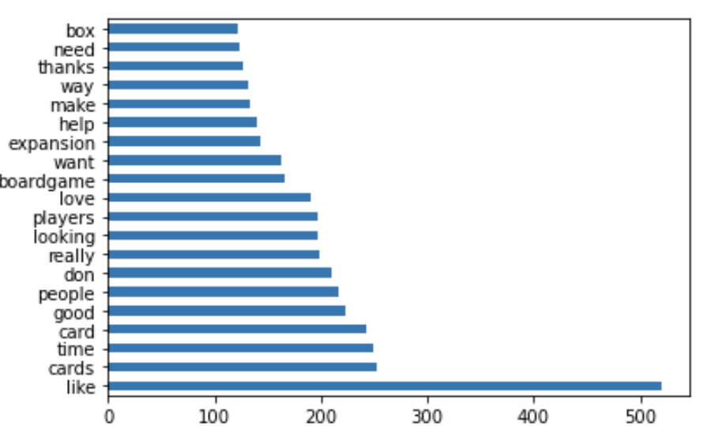

# Project 3: Web APIs & NLP & Classification

#### Goal: 
1. Using [Pushshift's](https://github.com/pushshift/api) API,  collect posts from two subreddits of your choosing.
2. Use NLP to train a classifier on which subreddit a given post came from. This is a binary classification problem.

### Contents

1. Problem Statement
2. Overview
3. Data Gathering
4. NLP Methodology
5. Classification Models and Predictions
6. Conclusion

### 1. Problem Statement

A gaming startup plans to create new boardgames and want to understand what game posts are getting more traction.

### 2. Overview

Reddit is a home to 100K+ communities, with 52M+ daily active users and 50B+ monthly views (updated Jan 2020) and provide human connections to conversation, posts, comments on variety of interests. Some of the interests I observed are in breaking news, sports, TV fan theories, gaming, products for skin etc. and much more.

We will leverage Reddit posts on Gaming community posts to understand interests, likes and dislikes on features and create a model to predict based on user posts using NLP methodologies. 

To determine some of the features and interests on how users use the gaming apps, products and tools - we will use 3 different sub-reddit categories - boardgames, Fallout and RocketLeagues games to build a model with the user posts and predict the sub-reddit category using NLP and Machine Language models. Ensure the models have good accuracy and precision scores to present to the executive leadership.

### 3. Data Gathering

Followed the process below to perform the data gathering:
1. Pushshift API provides reddit posts from their submissions and comments area. There is lot of information within the reddit submissions. We will use 3 categories from gaming section of submissions.
2. Tested the API to pull first 100 posts and title and created a model to understand the underlying data on the submissions.
3. Created a function to gather more data in the size of 100 rows each for every sub reddit, introduced a timer in between the calls to ensure the API does not get overloaded.
4. Brought in 3 different categories - boardgames, Fallout, and RocketLeague totaling 4500 rows.
5. Added 4th category to see if the model performs any better or breaks. But not going to use for final modeling.
6. Concatenate all the dataframes capturing selftext, title and subreddit as our features needed. We will be using only selftext and title for our models classification.

### 4. NLP 

Here we focus on looking at the content our data gathered, perform EDA and NLP steps.

1. At a glance look for null data, Only found nulls in selftext but not in title.
2. Checked the value counts for target value - subreddit showed near balanced classification.
**Fallout         0.355556**
**RocketLeague    0.333333**
**boardgames      0.311111**
3. Total dataset was 4500 rows
4. For all nulls in selftext - added a stop word "do" since it will be removed as part of our NLP processing, so that we can merge the selftext and title data to combine and get the completed submission_text
5. We now have submission_text and subreddit to work with
6. While exploring data in submission_text, figured the data needs to be cleaned for urls, special punctuations, [removed] etc. Created a function to tokenize and bring words and lemmatize the words in the submission_text. Brought down the size to 4091 records.
7. Added few other features to understand how bigrams and trigrams look. Post length, Post word count has been created to see the distribution.
8. Now we have clean words that can be used for NLP vectorizers and classification models. Save that to csv - datasets/redditready.csv

### 5. Classification Models and Predictions

** The 2 models used in our classification problem are: **

1. Naive Bayes - Multinomial Classifier with TfidfVectorizer and GridSearchCV
   
   ** I have used MultinomialNB as it works well with positive integers and great at predicting multi classification problems. As I chose 3 classifiers in the dataset, MultinomialNB with CountVectorizer using GridSearchCV and hyperparameter tuning with Pipelines.
   The best parameters used:
    - max_df = 0.85
    - max_features = 4000
    - min_df = 2
    - ngram_range = (1, 1)
    
    The classification report generated from Multinomial NB is as follows:
    
    
    
2. SVM - Support Vector Classifier with CountVectorizer and GridSearchCV
  
  ** SVC is from Support Vector Machines algorithm providing regularization as part of the hyper parameter tuning. Used kernel and C to tune the model and get the best parameters to work with. Used GridSearchCV with the Pipelines.
  The best parameters used:
    - C value = 0.4737368421052632
    - kernel = linear
    - degree = 2
    - gamma = scale
  
   The classification report generated from SVM is as follows:
  
  

### 6. Conclusion

Overall, MultinomialNB with TfidfVectorizer model performed better even though it was sligthly overfit. The model produced the scores as following:
- Accuracy score on Train Data: 0.8983050847457628
- Accuracy score on Test Data: 0.8064516129032258

The accuracy score for the model is at 80.64%, which yielded 

|---|precision|recall|f1-score|support|
|---|---|---|---|---|
|boardgames|0.902098|0.808777|0.852893|319.00000|
|RocketLeague|0.762836|0.881356|0.817824|354.000000|
|Fallout|0.777439|0.728571|0.752212|350.000000|

When compared to SVM classifier, this model performed with better precision score for boardgames topping at 90%.

Based on the most common 25 words for boardgames, there were lot of positive words represented in the distribution. Words such as like, love, fun, best, need, make, help, expansion were part of the posts for boardgames. 

